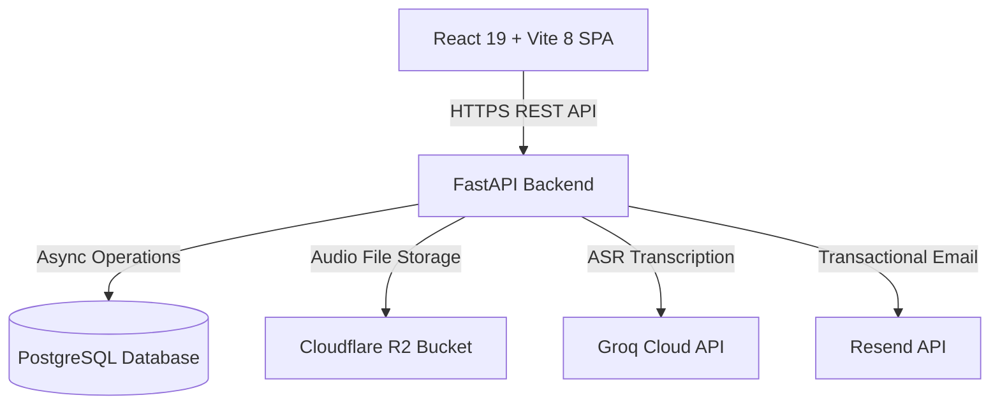

# HearMeRead
A Speech Processing Framework for Automated Oral Reading
## Error Detection Using Levenshtein Distance

# Documentation Manual
## User Manual + Technical Manual
**Version 1.0 · May 2026**

**Website Link:** [hearmeread.site](https://hearmeread.site) / [hearmeread.pages.dev](https://hearmeread.pages.dev)  
**Supported Grades:** Grade 1, Grade 2, and Grade 3 — Filipino and English  
**Framework:** DepEd CRLA (Classroom Reading Level Assessment)  

---

## P A R T   I: USER MANUAL
*For Teachers and School Administrators*

### 1. Introduction
HearMeRead is an automated oral reading assessment tool designed for elementary school teachers in Grades 1 to 3. It helps teachers conduct, record, score, and track reading assessments following the DepEd Classroom Reading Level Assessment (CRLA) framework.

With HearMeRead, you can:
* Record a student reading aloud and automatically transcribe the audio.
* Score the reading against the passage text to identify miscues — substitutions, insertions, and deletions.
* Classify the student's reading level (Full Refresher, Moderate Refresher, Light Refresher, Grade Ready).
* Track student reading profiles across the school year (Beginning, Middle, and End of School Year).
* Export results to Excel or PDF for DepEd reporting.

#### Role Responsibilities
* **Teacher:** Conducts assessments, manages students and class passages, views class records, and exports results.
* **Admin:** Oversees all teachers and classes at the school, manages teacher class assignments, and manages the school-wide public passage library.

---

### 2. Getting Started

#### 2.1 Creating an Account
You will need a school code from your school administrator before you can register as a teacher.
1. Go to the HearMeRead website and click **Register**.
2. On the sign-up form, toggle your role between **Teacher** and **Admin**.
3. Fill in your **First Name** and **Last Name**.
4. Set your school association:
   * **If registering as a Teacher:** Enter your school's **DepEd School ID** (6-digit number) or the **School Code** provided by your admin. The system will look up the school automatically and lock in the School Name.
   * **If registering as an Admin:** Enter the **School Name** and **DepEd School ID** manually. Upon successful sign-up, the system will generate a unique School Code for your school.
5. Enter your email address and password.
6. Check the **Terms and Conditions** and **Data Privacy** boxes, then click **Register**.

> [!NOTE]
> **Password Requirements:** At least 8 characters, containing at least one uppercase letter, one lowercase letter, one number, and one special character (e.g. `!@#$`).

#### 2.2 Email Verification
1. Open your email inbox and locate the message from HearMeRead.
2. Click the verification link in the email.
3. You will be redirected to a confirmation page. Once verified, you can log in.

> [!WARNING]
> The email verification link expires after 24 hours. If it expires, click **Resend verification email** on the login page and enter your email address.

#### 2.3 Logging In
1. Go to the HearMeRead website and click **Log In**.
2. Enter your email address and password, then click **Log In**.
3. Teachers are redirected to the Teacher Dashboard; Admins go to the Admin Dashboard.

> [!IMPORTANT]
> Your session stays active for up to 4 hours. However, if you are inactive (no mouse movement, scrolling, or typing) for 30 minutes, you will be automatically logged out to protect student data.

#### 2.4 Forgot Your Password?
1. On the login page, click **Forgot password?**
2. Enter your registered email address and click **Send Reset Link**.
3. Check your email for a message from HearMeRead, click the reset link, and enter a new password.

---

### 3. Teacher Guide

#### 3.1 The Dashboard
The Teacher Dashboard presents a summary of your class's oral reading performance:
* **Summary Cards:** Shows average reading accuracy, number of students assessed, and the overall error rate.
* **Reading Profile Chart:** Displays the distribution of students by reading level, split by gender.
* **Fluency Chart:** Tracks average words-per-minute (WPM) across school year assessment periods.
* **New Session Button:** Starts a new oral reading assessment.

The left sidebar navigation links are: **Dashboard**, **Assessment**, **Passages**, **Student Records**, **My Profile**, and **Logout**.

#### 3.2 Running an Assessment
Assessments are conducted one-on-one. The total assessment takes around 3 to 5 minutes per student (up to 10 minutes depending on the student's speed). Click **New Session** on the dashboard or **Assessment** in the sidebar to begin.

##### Session Information (Step 1)
Fill in the details for this assessment:
* **School Year:** Selected from options (e.g. "2025-2026").
* **Assessment Period:** Beginning of School Year (BoSY), Middle (MoSY), or End (EoSY).
* **Student:** Search and select the student from a dropdown list. 
* **Language:** Select Filipino or English.
* **Passage:** Select from the available passages.

> [!NOTE]
> Grade level and section are pre-filled automatically based on your teacher profile. The student search dropdown automatically excludes students who have already completed an assessment for the chosen school year and period to avoid duplicate assessments.

##### Assessment 1, Task 1 — Gawain 1 (Step 2)
The reading text for Task 1 is shown on screen.
* Click the **Record** button. A 3-second countdown overlay appears before recording starts.
* The student reads aloud. A red indicator shows the recording is live.
* You can **Pause** and **Resume** at any time.
* When done, click **Stop**.
* A confirmation prompt asks if you want to keep the recording or retake it.
* **Alternative:** If you recorded the audio separately, click **Upload** and select the audio file (supported formats: MP3, WAV, M4A, OGG, WebM).

##### Review the Transcript — Task 1 (Step 3)
The system processes the audio using speech-to-text. The transcribed text appears in an editable box.
* **Important:** Carefully review the transcript. Correct any mis-transcriptions by typing edits directly, then click **Confirm**.

##### Task 1 Results & Routing (Step 4)
The system scores Task 1 and determines the student's route for Task 2:

| Language | Task 1 Score | Route taken | Task 2 Content |
| :--- | :--- | :--- | :--- |
| **Filipino** | $\le 6$ correct items | **Lower Route (Task 2L)** | Grade 1: Rhyme Pairs (no recording)<br>Grades 2–3: Simpler Word list (recorded) |
| **Filipino** | $> 6$ correct items | **Higher Route (Task 2H)** | Set of Sentences (recorded) |
| **English** | $= 0$ correct items | **Assessment Ends** | Assessment ends; classification set automatically to *Full Refresher* |
| **English** | $\ge 1$ correct items | **Lower Route (Task 2L)** | Word list (recorded; no sentences route exists for English) |

> [!NOTE]
> **Grade 1 Filipino Task 2L (Rhyme Scoring):** For Grade 1 Filipino on the lower route, Task 2 is a rhyme identification task. The teacher reads each pair aloud and marks **Oo** if they rhyme, or **Hindi** if they do not. No audio is recorded for this step.

##### Assessment 1, Task 2 — Gawain 2 (Step 5)
The recording, transcription review, and confirmation processes are identical to Task 1, except the text shown is tailored to the route (word list or sentences).

##### Assessment 1 Results — Full Summary (Step 6)
The combined Task 1 + Task 2 scores determine the Assessment 1 Classification:
* **Full Refresher:** Learner needs intensive reading intervention (Filipino 2L: 0–14 | English: 0).
* **Moderate Refresher:** Learner needs significant reading support (Filipino 2L: 15–20 | English: 1–6).
* **Light Refresher:** Learner is nearly ready for grade-level reading (Filipino 2H: 7–16 | English: 8–16).
* **Grade Ready:** Learner is ready for grade-level reading (Filipino 2H: 17–20 | English: 17–20).

The system decides if the student qualifies to continue to Assessment 2:
* **Proceeds to Assessment 2:** Students on the higher route (sentences) who score above the threshold.
* **Skips to Observation:** Students on the lower route (words/rhymes) skip Assessment 2.

##### Choose a Story for Assessment 2 (Step 7)
If the student qualifies, select a story from the grid. Each story card shows the title and word count.

##### Assessment 2 — Story Reading (Step 8)
The student reads the full story aloud while you record. The grade-level time limit applies:
* **Grade 1:** 1 minute (60 seconds)
* **Grade 2:** 2 minutes (120 seconds)
* **Grade 3:** 3 minutes (180 seconds)

> [!IMPORTANT]
> The timer is not visible to the student. When the limit is reached, the recording automatically pauses, and a prompt asks you whether to let the student continue or stop. If you continue, the recording resumes, but words read past the limit will be tracked separately.

##### Review the Transcript — Assessment 2 (Step 9)
Verify the transcript against the story. Words read before the time limit are highlighted in blue. Make any corrections and click **Confirm**.

##### Comprehension Questions (Step 10)
Ask the student each comprehension question shown on screen. Mark each answer:
* **Correct:** Student answered correctly.
* **Wrong:** Student gave an incorrect answer.
* **N/A:** The question was skipped or not asked.

##### Learner Experience Rating (Step 11 — Interactive)
This is an interactive step for the student. Present the screen to the student and have them tap the emoji face that describes how they felt during the assessment:
* **Very Hard** (score 2)
* **Struggled** (score 4)
* **Okay** (score 6)
* **Good** (score 8)
* **Excellent** (score 10)

##### Observation (Step 12)
Record your observation of how the student read:
* **Level 1:** Reads word by word.
* **Level 2:** Reads word in chunks.
* **Level 3:** Reads fluently but not observing punctuation marks.
* **Level 4:** Reads fluently with proper expression.

You may add optional remarks before clicking **Save**.

##### Final Results (Step 13)
The final screen displays the assessment summary. Reading Profiles are determined by accuracy percentage (correct words read / passage length) and comprehension score:
* **Low Emerging Reader:** Did not reach Assessment 2 (Part 1 score $\le 10$).
* **High Emerging Reader:** Reached Assessment 2 but read very little (accuracy $< 25\%$ or comprehension $= 0$).
* **Developing Reader:** Read 25%–50% of the passage correctly; comprehension score of 1–2.
* **Transitioning Reader:** Read 51%–75% of the passage correctly; comprehension score of 3–4.
* **Reading at Grade Level:** Read $> 75\%$ of the passage correctly; comprehension score of 5–6.

> [!TIP]
> If accuracy and comprehension fall into different levels, the system uses accuracy as a tiebreaker. From the results screen, you can print the report as a PDF, export the session details to Excel, or start a new session.

#### 3.3 Managing Students
* **Viewing Students:** Click **Student Records** in the sidebar. Students are displayed as cards showing their LRN, sex, grade level, latest reading profile, and total sessions. You can search by name or LRN.
* **Adding a Student Manually:** Click **Add Student**. Fill in the LRN (must be exactly 12 digits), Sex, First Name, Last Name, Grade Level, and Section, then click **Save**.
* **Importing Students from Excel:** Click **Import Students**. Upload an Excel file containing columns: `LRN`, `First Name`, `Last Name`, `Sex`, `Grade Level`, and `Section`.
* **Student Profile:** Click a student card to view detailed stats (total assessments, average accuracy, WPM, and latest observation level) and full session history.

#### 3.4 Managing Reading Passages
Click **Passages** in the sidebar. Passages are separated into **Assessment 1** and **Assessment 2 (Stories)**. 
* **Public Library:** Public passages provided by the school admin cannot be edited by teachers.
* **Adding Passages Manually:** Fill in the text fields (Task 1 content, Task 2 words, Task 2 sentences, or Story details and comprehension questions) and click **Save**.
* **Document Import:** Drag and drop a `.docx` or `.txt` file into the upload modal.
* **Download Template:** Inside the upload modal, click **Download Template**. The system will automatically generate and download a pre-formatted template based on your assigned grade level and language to guarantee error-free document parsing.
* **Bulk Upload:** You can select and upload multiple document files at once. The system parses them in bulk and saves them to your library.

#### 3.5 Class Record
The Class Record provides a spreadsheet view of your class's assessment results. Go to **Student Records** and click **Class Record**. Filter by School Year, Assessment Period, and Language. You can print or export this table to Excel.

#### 3.6 Your Profile
Click **My Profile** in the sidebar. 
* **Editable Fields:** First Name, Last Name, Profile Picture (JPEG, PNG, WebP).
* **Locked Fields:**
  * **Employee ID:** Locked permanently after your initial save. Maximum of 7 characters.
  * **School details, Grade, and Section:** Assigned by the administrator; cannot be modified by the teacher.

---

### 4. Admin Guide

#### 4.1 Admin Dashboard
The Admin Dashboard displays school-wide performance statistics:
* **Total Teachers:** Count of registered teachers at the school.
* **Students Assessed:** Unique students with at least one completed session.
* **Total Sessions:** All created sessions.
* **Completion Rate:** Percentage of sessions that were completed.
* **School Code:** Displays the unique alphanumeric school code that teachers must use to register.

#### 4.2 Managing Teachers
Click **Teachers** in the sidebar.
* **Assigning a Class:** Click **Assign** on a teacher's row, choose the School Year and Grade Level, enter the Section name, and click **Assign**.
* **Editing Teacher Info:** Click **Edit** to modify assigned grade level or section. (The teacher's Employee ID is locked and read-only).
* **Archiving a Teacher:** Deactivates the teacher account. Archived teachers cannot log in, and their class rows appear disabled. Undo deactivation by contacting system support.
* **Viewing Activity Logs:** Click **Logs** on a teacher's row to view a detailed, paginated drawer of all their actions (such as logging in, creating students, starting sessions, and completing sessions) along with timestamps and metadata.

#### 4.3 Viewing Student Records
Click **Student Records** in the sidebar to see school-wide classes grouped by school year. You can view read-only class records or reassign class ownership to another teacher.

#### 4.4 Managing Public Passages
Admins can add, edit, or archive public passages in the sidebar. Public passages are read-only for teachers and are distributed to all classes matching the passage's grade and language.

---

### 5. Frequently Asked Questions

* **Why is the school name read-only during registration?**  
  As a teacher, once you enter a valid School Code or DepEd School ID, the system looks up the school in the database and automatically autofills the school name to ensure all teachers are correctly grouped under the same school entity.
* **Can I edit my Employee ID if I typed it wrong?**  
  No. Once you save your Employee ID on the profile page, it is permanently locked to secure teacher identities. If you made a mistake, please contact system support to reset it.
* **What happens if the student reads past the time limit in Assessment 2?**  
  The system automatically pauses when the time limit (60s, 120s, 180s) is reached. If you click continue, the recording continues, but the words read past the limit are tracked separately and do not inflate the student's Correct Words Per Minute (CWPM) score.
* **Why did an English student skip Assessment 2?**  
  Following the CRLA guidelines, English assessments do not have a sentences route (Task 2H) or connected story reading (Assessment 2). English students route to Task 2 Words (word list) and then proceed straight to Observation and results.
* **How do I import rhyming word pairs for Grade 1 Filipino?**  
  You can click the **Download Template** button in the upload modal, which provides the correct structure: `word1, word2|Oo` or `word1, word2|Hindi` on separate lines under the `Task 2:` section.

---
---

## P A R T   I I: TECHNICAL MANUAL
*For System Developers and Administrators*



### 1. System Architecture & Stack

#### Frontend Layer
* **Framework:** React 19 + Vite 8.
* **Routing:** React Router v7.
* **Styling:** Vanilla CSS (no CSS frameworks) for layout performance and UI control.
* **State & HTTP:** Axios client with automated interceptors for token attachment and logout redirection on `401 Unauthorized` responses.
* **Utilities:** `xlsx` for parsing student imports; `mammoth` for client-side extraction of `.docx` documents; `recharts` for dashboard charts; `jsPDF` for reporting.

#### Backend Layer
* **API Framework:** FastAPI 0.111.
* **Database Driver & ORM:** SQLAlchemy 2.0 with `asyncpg` for asynchronous database connections.
* **Database Migrations:** Alembic.
* **Authentication:** Stateful JWT tokens (HS256) with a 240-minute (4 hours) lifetime.
* **PII Encryption:** Cryptography library (`Fernet` symmetric encryption) encrypts sensitive teacher details (e.g. names) at rest.
* **Third-Party Integrations:**
  * **Groq Cloud API:** Whisper-large-v3 model for speech-to-text.
  * **Cloudflare R2:** S3-compatible object storage for audio assets.
  * **Resend:** Transactional email sender for registration verification.

---

### 2. Scoring & Alignment Engine (Levenshtein Distance)

The core scoring engine uses a word-level Levenshtein distance algorithm to align the student's spoken reading against the reference passage.

#### 2.1 Text Preprocessing
Before computing edit distances, both the reference passage text ($R$) and the transcribed hypothesis text ($H$) are normalized:
1. Converted to lowercase.
2. All punctuation characters are stripped using regular expressions: `re.sub(r"[^\w\s]", "", text)`.
3. Extra whitespaces are collapsed.
4. The text is tokenized into lists of words: $R = [r_1, r_2, \dots, r_m]$ and $H = [h_1, h_2, \dots, h_n]$.

#### 2.2 Alignment Matrix and Backtracking
An $(m+1) \times (n+1)$ dynamic programming matrix $D$ is built, where $D[i][j]$ represents the minimum edit distance between prefix $R[1..i]$ and $H[1..j]$:

$$D[i][j] = \min \begin{cases} D[i-1][j] + 1 & \text{(Deletion)} \\ D[i][j-1] + 1 & \text{(Insertion)} \\ D[i-1][j-1] + \text{cost} & \text{(Substitution/Match)} \end{cases}$$

where $\text{cost} = 0$ if $r_i = h_j$, and $1$ otherwise.

Backtracking begins from $D[m][n]$ to $D[0][0]$ to determine the optimal edit path. Backtracking rules prioritize matches, then substitutions, deletions, and insertions:

```python
# Backtracking logic snippet (app/services/levenshtein_service.py)
while i > 0 or j > 0:
    if i > 0 and j > 0 and reference[i - 1] == transcribed[j - 1]:
        alignments.append(WordAlignment(reference[i-1], transcribed[j-1], MiscueType.CORRECT))
        i -= 1; j -= 1
    elif i > 0 and j > 0 and dp[i][j] == dp[i - 1][j - 1] + 1:
        alignments.append(WordAlignment(reference[i-1], transcribed[j-1], MiscueType.SUBSTITUTION))
        i -= 1; j -= 1
    elif i > 0 and dp[i][j] == dp[i - 1][j] + 1:
        alignments.append(WordAlignment(reference[i-1], None, MiscueType.DELETION))
        i -= 1
    else:
        alignments.append(WordAlignment(None, transcribed[j-1], MiscueType.INSERTION))
        j -= 1
```

#### 2.3 Metric Calculations
* **Substitutions ($S$):** Spoken word does not match the reference word.
* **Deletions ($D$):** Student skipped a word from the reference text.
* **Insertions ($I$):** Student spoke extra words not present in the reference text.
* **Correct Words ($C$):** $C = |R| - S - D$. Note that insertions do not subtract from the correct count.
* **Accuracy Percentage:** 

$$\text{Accuracy (\%)} = \frac{C}{|R|} \times 100$$

* **CWPM (Correct Words Per Minute):**

$$\text{CWPM} = \frac{C_{\text{within limit}}}{\min(\text{Reading Time}, \text{Grade Limit}) / 60}$$

#### 2.4 Time Capping and Timestamp Synchronization
For Assessment 2, the system caps the reading time. Using the Groq Whisper API's word-level timestamps (`word_timestamps=True`), the system receives an array of JSON objects containing `{"word": str, "start": float, "end": float}`.
1. The alignment engine matches transcribed words to reference words.
2. Words whose `start` timestamp is greater than the grade-level cap (60s, 120s, 180s) are excluded from the $C_{\text{within limit}}$ calculation.
3. This prevents a student's fluency score from being inflated by reading the entire story far past the timed limit.

---

### 3. Document Parsing Engine

To make reading passage creation fast, HearMeRead parses uploaded Word (`.docx`) or text (`.txt`) documents on the client side using regular expressions.

#### 3.1 Assessment 1 Parser Format
The document parser expects structured blocks to assign properties:
* **`Language:`** Followed by `Filipino` or `English`.
* **`Grade:`** Followed by `1`, `2`, or `3`.
* **`Task 1:`** Content block containing letters (Grade 1 Filipino) or words.
* **`Task 2 Words:`** (or `Task 2:` for Grade 1 Filipino) Comma-separated words or rhyming pairs formatted as `W: word1, word2` and `R: Oo/Hindi`.
* **`Task 2 Sentences:`** Period-separated sentence strings.

#### 3.2 Assessment 2 Parser Format
Uses block boundary markers:
* **`[PASSAGE]`** Marks the start of the story content.
* **`[QUESTIONS]`** Marks the start of the comprehension section.
* **`Q:`** Identifies a question.
* **`A:`** Identifies the expected answer.

---

### 4. Database Schema

The simplified database relationships are structured as follows:

```
[Teacher] 1 ------ * [Student]
    1                  1
    |                  |
    |                  *
    * ------------ 1 [AssessmentSession] 1 ------ 0..1 [ReadingResult]
    |                                    1
    |                                    |
    *                                    *
    ------------------------------- 1 [SessionObservation]
```

* **`teachers`:** Profile data, hashed passwords, encrypted first and last names (AES-128 Fernet).
* **`students`:** LRN (12 digits, unique), grade level, section, and owner teacher.
* **`passages`:** Reading material metadata, content blocks, and visibility (`private` vs. `public`).
* **`assessment_sessions`:** Assessment status, school year, period, and link records.
* **`reading_results`:** Performance metrics, accuracy, CWPM, reading profile, and JSON alignment matrices.
* **`session_observations`:** Comprehension counts, teacher remarks, observation levels (1–4), and learner experience ratings (1–5).
